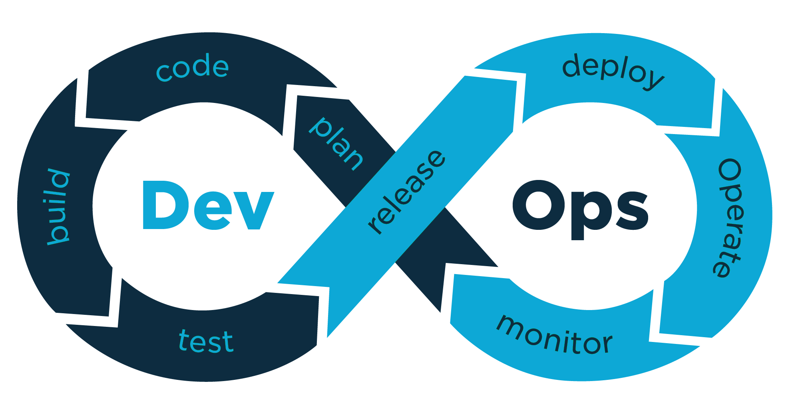

    

<h1 id = "projectDescription" align="center">Pipeline CI/CD</h1>

Este projeto tem como objetivo demonstrar a implementação de uma pipeline de Integração Contínua (CI) e Entrega Contínua (CD) utilizando práticas de DevOps. 

## Sumário

<ul>
    <li><a href = "#run">Descrição do projeto</a></li>
    <li><a href = "#while">Objetivo do site</a></li>
    <li><a href = "#for">Link do site</a></li>
    
</ul>

 
<h2 id="run">Descrição do projeto</h2>

O projeto se baseia em tecnicas de DevOps para realizar, de forma, automatizada, os testes e deploy de um site. Para isso, utilizamos das seguintes tecnologias:

- Host com o Azure Web Apps

- Integração em Sonarqube (CI)

- Teste de deploy com Docker

- Testes e2e com Cypress

<h2 id="while">Objetivo do site</h2>

Este projeto é um esforço em demonstrar a importância da conscientização sobre a preservação do meio ambiente, e o impacto de alguns hábitos diários nas emissões de CO². O conteúdo apresentado foi construído com base em dados coletados por meio de uma pesquisa, realizada pelo grupo no dia 26 de abril de 2025 no parque da cidade de Jundiaí. As perguntas da pesquisa foram elaboradas com foco no ODS 15 (Objetivo de Desenvolvimento Sustentável) da ONU, que trata da proteção da vida terrestre e do desenvolvimento sustentável. As respostas obtidas foram organizadas em formato tabular e gráficos relacionados à emissão de CO₂.
 

<h2 id="for">Link do site</h2>

Acesse o site aqui: <a href="https://pesquisa-emissao-co2.azurewebsites.net/index.html">Emissão de CO²</a> 

<h2>Pipeline</h2>
<h3>Integração</h3>

Toda modificação enviada para a branch 'dev' ativa o gatilho para o arquivo de integração, que roda o Sonarqube no nosso Azure através das aplicações do GitHub Actions.

<h3>Entrega</h3>

O workflow de entrega é ativado quando um 'pull request' é feito para a branch main. Há dois jobs nesta etapa do processo: 'deploy' e 'integration-test'.
<ul>
    <li>O 'deploy' realiza o login no Docker de acordo com as chaves fornecidas, para que possa realizar o build e push do projeto. Ele também realiza o deploy do site, utilizando o web app do Azure.</li>
    <li>O 'integration-test' roda numa máquina virtual Ubuntu, instala os pacotes necessários e realiza os testes do Cypress.</li>
Se Todos os passos do workflow ocorrrem sem erros, o merge das novas modificações é feito com a main branch e automaticamente atualiza o site.
</ul>

